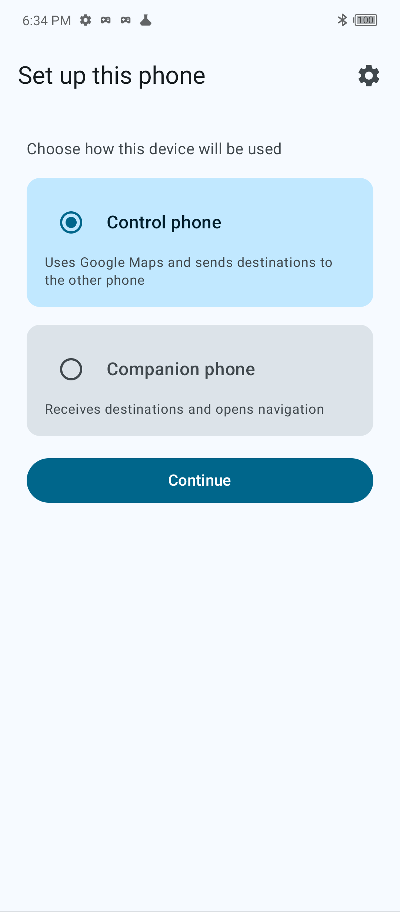
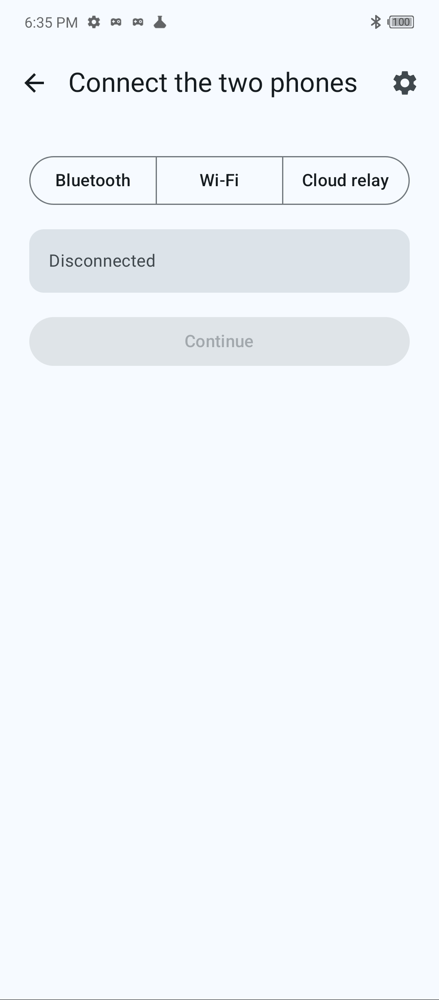
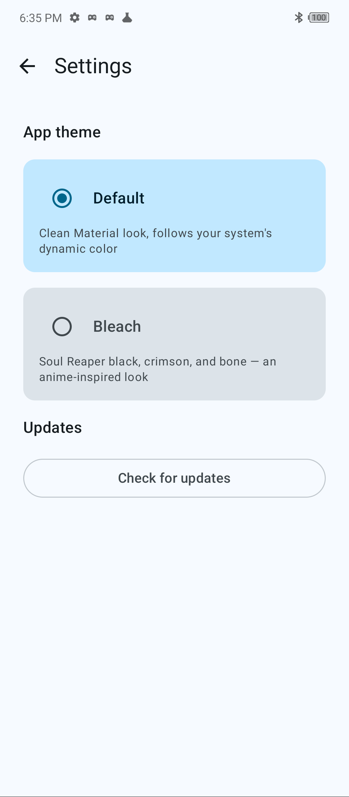
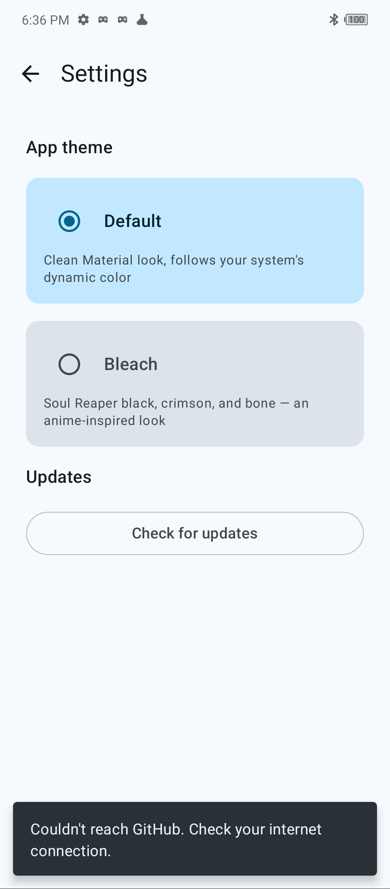

# DualNav

Split your phone's job in two: one phone picks the destination, the other one drives with it open in
Google Maps.

## About

DualNav pairs two Android phones — a **Control** phone and a **Companion** phone:

- **Control phone** — pick a destination (paste a Google Maps link, or enter coordinates manually),
  choose a travel mode, and send it over.
- **Companion phone** — sits mounted where you can see it, receives the destination, and opens
  turn-by-turn navigation in Google Maps automatically.

This is useful for two-wheelers where the rider's phone is mounted for navigation but a passenger (
or the rider, before setting off) wants to plan the route from a second phone without touching the
mounted one mid-ride. Control can also add stops, or send stop/resume commands to Companion, while a
ride is in progress.

Phones connect over whichever transport fits the situation:

| Transport                  | Best for                                                   |
|----------------------------|------------------------------------------------------------|
| **Bluetooth**              | No internet needed, phones are near each other             |
| **Wi-Fi**                  | Local network, faster than Bluetooth                       |
| **Cloud relay** (Firebase) | Phones aren't on the same network — pair with a short code |

A reconnection session is kept so if one phone drops out mid-ride, the pair can pick the connection
back up rather than starting pairing from scratch.

## Usage

1. **Install** the app on both phones (see [How to update](#how-to-update) for where builds come
   from).
2. On first launch, each phone picks its role — **Control phone** or **Companion phone**.
3. On the **Control** phone, choose a connection type (Bluetooth / Wi-Fi / Cloud relay) and pair
   with the Companion phone.
    - Bluetooth/Wi-Fi: Control scans and lists nearby devices to connect to.
    - Cloud relay: Control generates a short code; enter that code on the Companion phone to join.
4. Once connected, on the **Control** phone:
    - Paste a Google Maps share link (or tap the map icon in the top bar to open Google Maps and
      copy one), or enter coordinates manually.
    - Pick a travel mode — **Car** or **Two-wheeler**.
    - Tap **Send destination**. The Companion phone opens Google Maps navigation immediately.
    - Add stops, or send **Stop**/**Resume** to control navigation on the Companion phone remotely.
5. Themes, the connection status, and the update checker all live under **Settings** (gear icon).

## Contribute

Contributions are welcome — bug reports, fixes, and features alike.

1. Fork the repo and create a branch off `master`.
2. Build and run the `github` flavor locally:
   ```
   ./gradlew :app:assembleGithubDebug
   ```
3. The app follows a layered MVI architecture per feature (`domain` → `data` → `presentation`), with
   Koin for dependency injection — one module per concern under
   `app/src/main/java/com/blez/dualnav/di/`. Keep new features consistent with that shape: a
   `ViewModel` + `State`/`Action`/`Event` contract per screen, repositories/data sources behind
   domain interfaces, and DI wiring in a dedicated Koin module.
4. Open a PR against `master` describing what changed and why. Screenshots or a short clip are
   appreciated for UI changes.

If you're planning a larger change, open an issue first to discuss the approach before investing
time in it.

## Screenshots

| Role selection                                         | Connect the two phones                                     | Settings — Updates                                                     |
|--------------------------------------------------------|------------------------------------------------------------|------------------------------------------------------------------------|
|  |  |  |

The update checker reaching out to GitHub and reporting back (here, no network route to GitHub was
available in the environment this was captured in):



## How to update

DualNav isn't distributed on the Play Store — it self-updates from this
repo's [GitHub Releases](https://github.com/blezDev/DualNav/releases) instead:

1. Open **Settings** → **Updates** → **Check for updates**.
2. DualNav asks the [GitHub Releases API](https://docs.github.com/en/rest/releases) for the latest
   release tag and compares it against the version you're running.
3. If a newer release exists **and** has an `.apk` asset attached, tap **Download & install** —
   DualNav downloads it via the system Download Manager (you'll see a native download-progress
   notification) and launches the installer as soon as it lands, no need to dig through your
   Downloads folder.
4. If the release has no `.apk` attached, DualNav opens the release page on GitHub instead so you
   can grab it manually.
5. The first time you do this, Android will ask you to allow DualNav to install unknown apps —
   DualNav also asks for this once up front, right at first launch, so this step is normally already
   out of the way.

Releases are built from the `github` product flavor (`./gradlew :app:assembleGithubRelease`), which
is what points the update checker at this repository.
